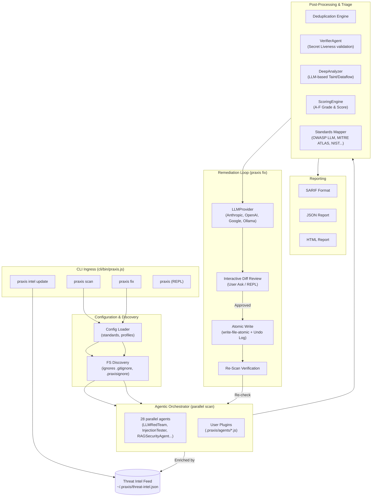

# Praxis

<p align="center">
  
</p>

<p align="center">
  <a href="https://github.com/Ganron007/Praxis/actions/workflows/ci.yml"></a>
  <a href="LICENSE"></a>
  =18.0.0">
  
  
</p>

Part of the [CADRE](https://github.com/Ganron007/CADRE) platform — AI-security scan → remediate → verify CLI (also used by DarkAI; runs standalone).

> [!NOTE]
> **Public Beta.** The core scan / fix / verify flows are stable and CI-tested; agent coverage and integration surfaces (GitHub Action, Claude Code plugin) are still being validated in the wild. Expect CLI flags, agents, and docs to keep evolving.

> [!IMPORTANT]
> **Local Privacy & Autopilot Safety.** Praxis is designed with an offline-first architecture. It will never transmit your source code to external servers or AI providers unless you explicitly configure LLM remediation. When LLM features are enabled, Praxis works in a **gated confirmation loop** — no file changes are written without your explicit approval, and every modification is fully reversible via local logs.

Praxis is an enterprise-grade autonomous AI-security audit framework designed to detect vulnerabilities and automate patch engineering. Operating as a command-line interface (CLI), Praxis analyzes application codebases, Model Context Protocol (MCP) server configurations, and AI agent integration points to identify traditional vulnerabilities and modern generative AI exposure risks. 

Unlike passive scanning tools that only generate static finding logs, Praxis provides an autonomous, closed-loop remediation pipeline. When vulnerabilities are detected, Praxis leverages cloud or local Large Language Models (LLMs) to automatically construct precise, context-aware code repairs (as unified diff patches). After user verification, the patches are written atomically to disk and immediately re-scanned to programmatically verify that the issue has been successfully resolved.

---

## Key Capabilities

* **AI-Security & Agentic Surface Auditing** — Scans and validates AI configuration artifacts, including agent prompts (`.cursorrules`, `CLAUDE.md`), Model Context Protocol (MCP) server tool declarations, machine learning model files (identifying pickle deserialization hazards in `.pkl`, `.pt`, and `.ckpt` files), and vector database context sources to mitigate prompt injection, excessive agency, and data poisoning risks.
* **Autonomous Remediation Loop** — Moves beyond traditional static analysis by dynamically drafting context-aware code modifications (unified diffs), presenting them for interactive validation, writing changes atomically to disk, and executing automated regression tests to verify compliance.
* **Offline-First Security Architecture** — Operates entirely locally with zero registration requirements or mandatory external data transmission. Core threat intelligence databases are stored and queried on-premise, preserving source code privacy and intellectual property.
* **Correlated Threat Intelligence** — Integrates and aggregates security data from 6 public feeds (OSV.dev, GitHub Advisory Database, CISA KEV, EPSS, NVD, and Gitleaks) and optionally correlates observations with 5 enterprise feeds (Snyk, Socket.dev, GitGuardian, Sonatype OSS Index, and Phylum) into a local SQLite repository database.
* **AI Compliance Mapping** — Programmatically aligns all findings with regulatory and industry frameworks, including the OWASP Top 10 for LLM Applications, MITRE ATLAS, NIST Generative AI Profile (AI 600-1), and the EU AI Act.

---

## Tool Flow

Praxis orchestrates codebase analysis, post-processing triage, and interactive remediation through a structured pipeline:



**Execution Pipeline Lifecycle:**
1. **CLI Ingress & Parsing** — CLI subcommands are parsed and processed. Target directories are crawled, filtering out files matched by `.gitignore` and `.praxisignore` rules.
2. **Reconnaissance & Profiling** — `ReconAgent` maps the repository's technology stack (e.g., frameworks, runtime engines) to optimize scanning profiles.
3. **Concurrent Security Scans** — 28 built-in analysis engines execute in parallel to identify code vulnerabilities and agent misconfigurations. Extensible local plugins are loaded dynamically from `.praxis/agents/*.js`.
4. **Post-Processing Triage** — Suspected secret disclosures are programmatically verified for liveness by `VerifierAgent`, static taint paths are analyzed by `DeepAnalyzer`, and the project security score is computed.
5. **Standards Compliance Mapping** — Identified vulnerabilities are programmatically mapped to corresponding controls from the 8 supported compliance frameworks.
6. **Remediation & Repair Verification** — When executing a repair, the `LLMProvider` constructs a context-aware remediation patch (as a unified diff). Once approved, updates are written atomically and verified through a follow-up scan.

---

## Quick Start

```bash
# Install and link globally
npm install
npm link

# Run a full scan (secrets, code vulnerabilities, AI agent configurations, dependency CVEs)
praxis scan .

# Run interactive LLM-guided fixes
praxis fix .

# Refresh threat intelligence local feeds
praxis intel update

# View an emoji-graded A–F summary score
praxis vibe .
```

---

## The Six Command Groups

```
praxis scan       Run security scans (optionally filter by security standards)
praxis fix        Apply remediations (interactive LLM, deterministic, or PR-based)
praxis agents     Audit AI/agent surface (skills, MCP tool safety, attestation, SBOM/ABOM)
praxis intel      Update and query the local threat-intelligence database
praxis report     Format, diff, and export scan reports (SARIF, HTML, JSON)
praxis project    Initialize settings, git hooks, Baselines, and plugin policies
```

*Plus top-level shortcuts: `praxis vibe`, `praxis score`, and standard `praxis` (without arguments) which opens an interactive TTY REPL.*

---

## 28 security agents

The core scanning engines run concurrently, automatically adapting their execution scope to match the project tech stack.

| Category | Agent | Description |
| :--- | :--- | :--- |
| **AI / LLM Security** | **LLMRedTeam** | Audits OWASP LLM Top 10 vulnerabilities, excessive agency, and system prompt leakage. |
| | **MCPSecurityAgent** | Detects Model Context Protocol (MCP) server misuse, tool poisoning, and inputs validation issues. |
| | **AgenticSecurityAgent** | Identifies OWASP Agentic AI Top 10 vulnerabilities: privilege escalation and agent hijacking. |
| | **RAGSecurityAgent** | Scans for vector database access control issues and context document poisoning. |
| | **MemoryPoisoningAgent**| Analyzes agent memory files (`.json`, `.md`) for hidden unicode payloads or instruction injections. |
| | **AgentConfigScanner** | Checks prompt configurations (`.cursorrules`, `CLAUDE.md`) and hooks for prompt injection. |
| | **ModelFileScanner** | Identifies pickle deserialization risk in model artifacts (`.pkl`, `.pt`, `.ckpt`) and missing model cards. |
| | **PromptInjectionProber**| Probes inputs for DAN-style jailbreaks and system persona bypass signatures. |
| | **ManagedAgentScanner** | Flags over-privileged policies (always-allow actions) and unrestricted network permissions. |
| | **HermesSecurityAgent** | Detects tool registry poisoning, function-call injection, and permission drift. |
| | **AgentTelemetryAgent** | Audits AI agent session histories (Claude Code, Cursor, Codex, Warp, Cline) for exposed keys, remote-shell, prompt overrides. |
| | **EndpointAgentAbuseAgent**| Detects local AI-agent abuse (EAA catalog): hook persistence, MCP env-expansion, gateway overrides, committed agent state. |
| | **AiInfraInventoryAgent**| Maps the production AI system: model gateways (LiteLLM/Portkey/Helicone/OpenRouter), AI runtimes in IaC, API endpoints + BOLA candidates. |
| **Code Vulnerabilities**| **InjectionTester** | Detects SQL/NoSQL injections, command injections, path traversals, XSS, and ReDoS. |
| | **ExceptionHandlerAgent**| Audits for empty catch blocks, unhandled rejections, and leaked stack traces in production. |
| | **VibeCodingAgent** | Highlights AI-generated code anti-patterns (e.g., TODO-auth, empty catches, missing validation). |
| **Authentication** | **AuthBypassAgent** | Flags JWT flaws (`alg:none`, weak secrets), CSRF, IDOR/BOLA, and disabled TLS verification. |
| | **SupabaseRLSAgent** | Scans for Supabase tables without Row Level Security (RLS) and client-leaked service_role keys. |
| | **APIFuzzer** | Detects unauthenticated API routes, mass assignments, and exposed GraphQL debug schema endpoints. |
| **Supply Chain** | **SupplyChainAudit** | Audits package manifests for typosquatting, wildcard dependencies, and suspicious scripts. |
| | **AgentAttestationAgent**| Flags unpinned agent dependencies, unsigned manifests, and missing integrity hashes. |
| | **AgenticSupplyChainAgent**| Detects over-privileged CI runner permissions, OAuth scope creep, and unsigned AI webhook receivers. |
| **Configuration** | **ConfigAuditor** | Audits Docker (root user, `:latest`), Kubernetes, Terraform, loose CORS, CSP, and Firebase settings. |
| | **MobileScanner** | Maps OWASP Mobile Top 10: insecure local storage, WebView injections, and debug builds. |
| **Secrets** | **GitHistoryScanner**| Performs deep git history scans to detect leaked API tokens, private keys, and credentials. |
| **CI/CD** | **CICDScanner** | Audits pipelines for runner poisoning, unpinned workflow actions, and secret logging hazards. |
| **Compliance** | **PIIComplianceAgent**| Scans codebase files for regulated personal data (SSNs, credit cards, emails, phone numbers). |
| | **LegalRiskAgent** | *(Opt-in)* Scans dependencies for copyleft/GPL contamination, dual-licensing, and IP/DMCA risks. |
| **Core Profiling** | **ReconAgent** | profiles framework types and technology vectors to configure the orchestration baseline. |

### Post-Processors
* **VerifierAgent** — Validates suspected secret leaks via live local checks to minimize false positives.
* **DeepAnalyzer** — Runs opt-in (`--deep`) LLM-based static taint and dataflow analysis.

---

## AI Security Standards Alignment

Every finding is automatically tagged with its corresponding control IDs from eight supported security frameworks:

* `owasp-llm` (OWASP Top 10 for LLM Applications)
* `mitre-atlas` (MITRE ATLAS Matrix)
* `nist-ai-600-1` (NIST Generative AI Profile)
* `avid` (AI Vulnerability Database)
* `owasp-ml` (OWASP Machine Learning Security Top 10)
* `eu-ai-act` (EU Artificial Intelligence Act)
* `iso-42001` (ISO/IEC 42001 AI Management System)
* `google-saif` (Google Secure AI Framework)

You can run standard-specific scans to filter and verify compliance against a specific framework:
```bash
# List all available standards
praxis scan standard --list

# Filter findings to OWASP LLM Top 10 controls only
praxis scan standard owasp-llm .

# Filter findings to a specific control index
praxis scan standard owasp-llm . --control LLM01
```

---

## Threat Intelligence Integration

Praxis aggregates threat feeds into a queryable local JSON database (`~/.praxis/threat-intel.json`) to enrich findings with vulnerability metrics:

* **Core Feeds (Free & Offline)** — OSV.dev, GitHub Advisory Database (GHSA), CISA Known Exploited Vulnerabilities (KEV), Exploit Prediction Scoring System (EPSS), NVD, and Gitleaks patterns.
* **Optional Feeds (Paid API Keys)** — Snyk, Socket.dev, GitGuardian, Sonatype OSS Index, and Phylum.

By syncing feeds locally, findings are automatically enriched with KEV exploitation indicators and EPSS likelihood scores to prioritize remediation.

For threat-intel configuration and customization guide, see **[docs/THREAT_INTEL.md](./docs/THREAT_INTEL.md)**.

---

## CI/CD Integration

Integrate Praxis into your build pipelines to block vulnerable code commits or publish SARIF reports directly to GitHub Code Scanning:

```bash
# Fail CI build if codebase security score falls below 80
praxis scan ci . --threshold 80

# Generate SARIF report for GitHub Code Scanning tab
praxis scan ci . --sarif results.sarif

# Enforce fresh threat feed and fail if intel database is older than 7 days
praxis scan ci . --strict-intel --max-intel-age 7d
```

Praxis includes a composite GitHub Action out-of-the-box. Refer to **[docs/USAGE.md](./docs/USAGE.md#cicd-integration)** for workflow integration details.

---

## Plugin System

Extend the agent orchestrator by adding custom JavaScript rule sets. Any class extending `BaseAgent` saved inside `.praxis/agents/` is automatically registered and run in parallel:

```bash
# Create a new local plugin template
praxis project plugins new my-rule
```

---

## Documentation Reference

| Document | Description |
| :--- | :--- |
| **[docs/USAGE.md](./docs/USAGE.md)** | Full CLI usage reference: commands, environment variables, settings, and baseline policies. |
| **[docs/THREAT_INTEL.md](./docs/THREAT_INTEL.md)** | Threat intelligence architecture, database schemas, and custom source integration. |
| **[docs/THIRD_PARTY_NOTICES.md](./docs/THIRD_PARTY_NOTICES.md)** | Licenses and attribution for vendored data assets (MITRE ATLAS, EAA catalog). |
| **[.github/CONTRIBUTING.md](./.github/CONTRIBUTING.md)** | Developer workflow, linting rules, tests structure, and guidelines for authoring agents. |
| **[.github/SECURITY.md](./.github/SECURITY.md)** | Security disclosure guidelines and contact endpoints. |
| **[CHANGELOG.md](./CHANGELOG.md)** | Version tag history and released changelog logs. |

---

## Scope & Limitations

Praxis is an **AI-security-first** scanner. Please read this honestly:

- **Complements, not replaces, general SAST.** Praxis focuses on the AI/agent attack
  surface (LLM calls, MCP, RAG, agent configs, model artifacts, prompt injection) plus a
  baseline of classic web/secret checks. For deep web SAST (Semgrep, CodeQL, Snyk Code
  class), use those tools *alongside* Praxis.
- **Detection is regex + LLM-assisted, not AST/dataflow.** Complex multi-step taint flows
  may be missed; findings carry confidence levels and optional `--deep` LLM verdicts to
  help you judge them.
- **A clean scan is not proof of absence.** No scanner provides 100% coverage; Praxis does
  not claim to.
- **Standards mapping is evidence-based, not certification.** Findings are tagged with
  controls from 8 frameworks (OWASP LLM/ML/Agentic, MITRE ATLAS, NIST AI 600-1, AVID,
  EU AI Act, ISO 42001, Google SAIF) for which the scan produced evidence. This supports
  compliance work — it does not certify compliance.
- **Remediations are gated and reversible.** LLM fixes are drafted as diffs, applied only
  with your approval (or explicit `--yolo`/`--ci` automation), verified by re-scan, and
  logged for `praxis fix undo`. Review diffs before applying them to production systems.

---

## License

This project is licensed under the MIT License — see the **[LICENSE](./LICENSE)** file for details.

> Copyright (c) 2026 Praxis contributors.
