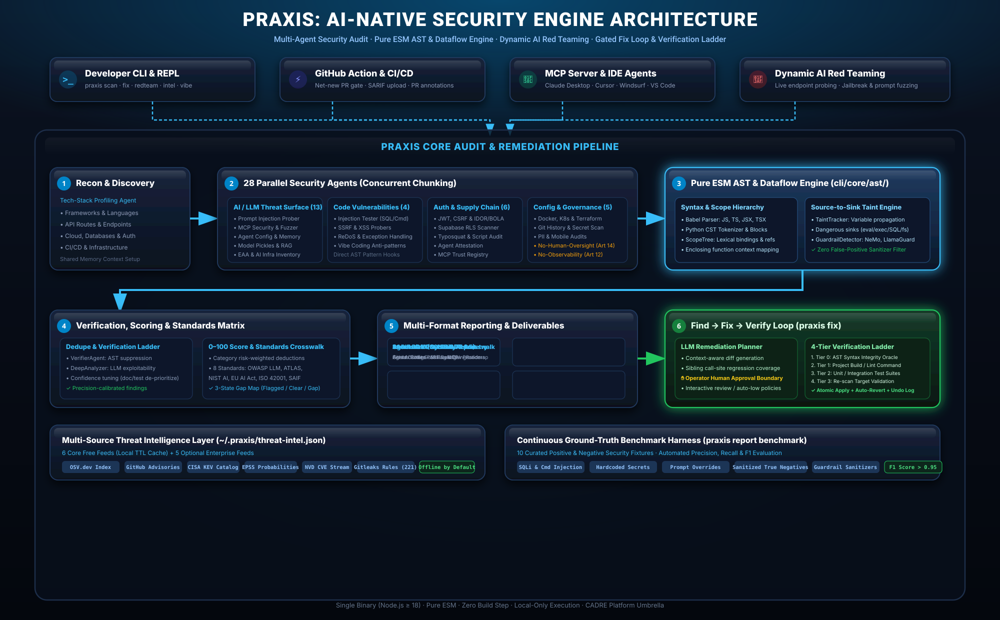

# Praxis

<p align="center">
  
</p>

<p align="center">
  <a href="https://github.com/Ganron007/Praxis/actions/workflows/ci.yml"></a>
  <a href="LICENSE"></a>
  =18.0.0">
  
  
</p>

**Praxis is an AI-security-first audit CLI with a working fix loop.** 28 parallel
agents scan your codebase — secrets, code vulnerabilities, and the entire AI/agent
attack surface (LLM calls, MCP servers, RAG pipelines, model files, agent configs,
agent telemetry) — then an LLM drafts fixes you approve, applies, verifies, and can
undo. Offline by default. No registration, no data leaves your machine.

Part of the [CADRE](https://github.com/Ganron007/CADRE) ecosystem — aligned with the [DarkAI](https://github.com/Ganron007/DarkAI) AI red-team lab extension while running fully standalone.

> [!IMPORTANT]
> **Local & gated by design.** Core scans run entirely offline. LLM remediation is
> opt-in, drafts diffs for your approval, writes atomically, and logs every change
> for undo.

---

## What it does

| Capability | In one line |
| --- | --- |
| **AI/agent surface audit** | 28 concurrent agents: prompt injection, MCP tool abuse, agent-memory poisoning, pickle-based model files, RAG, agent session telemetry, local agent-abuse (EAA), and AI infrastructure inventory (gateways, runtimes, API endpoints) |
| **AST & Taint Dataflow** | Pure ESM AST & CST parsing (JS/TS & Python) with lexical scope trees, intra-file taint tracking, source-to-sink data flow, and guardrail detection |
| **Dynamic AI Red Teaming** | DAST fuzzing engine for live LLM endpoints and agent runtimes (`praxis redteam`) with customizable attack probes and evasion benchmarks |
| **Find → fix → verify** | LLM drafts a diff → you approve → atomic apply → tiered verification ladder (AST syntax → build → tests → re-scan) with auto-revert of failed fixes → undo log |
| **Governance audits** | Detects *missing* controls: no human-oversight gates, no observability wiring — EU AI Act Art. 14 / 12 evidence |
| **MCP trust registry & live probing** | Known MCP servers with trust scores (SHA-256 integrity-checked) + live runtime JSON-RPC handshakes and tool fuzzing (`--test-live`) |
| **Threat intel** | 6 free feeds cached locally (OSV, GHSA, KEV, EPSS, NVD, Gitleaks) + 5 optional paid; findings enriched with exploit likelihood |
| **Compliance mapping** | Findings tagged against 8 frameworks — OWASP LLM/ML/Agentic, MITRE ATLAS (+ mitigations & case studies), NIST AI 600-1, AVID, EU AI Act, ISO 42001, Google SAIF |
| **Executive Pro Report** | Interactive dark-mode HTML: sidebar navigation, real-time search & severity filters, code line highlighting, AST taint blocks, AI lanes, and remediation roadmap |
| **CI-native** | `scan ci` gates, SARIF for Code Scanning, net-new PR gating (fails only on *introduced* findings), GitHub Action inline PR annotations |

## Quick start

```bash
npm install && npm link

praxis scan .            # full 28-agent audit + AST taint evaluation
praxis fix .             # interactive LLM-guided fixes
praxis redteam .         # dynamic AI red team & DAST prober
praxis agents audit .    # audit the AI/agent surface
praxis agents mcp --test-live  # live MCP JSON-RPC probe
praxis report benchmark  # run ground-truth accuracy benchmark
praxis intel update      # refresh local threat feeds
praxis vibe .            # emoji-graded A–F score
```

`praxis --help` lists everything. Run `praxis` with no args for the interactive REPL.

## How it works

<p align="center">
  
</p>

## Command groups

```
praxis scan       secrets · full · changed · env · redteam · standard · ci
praxis fix        interactive · quick · from-report · rotate · undo · env-template
praxis agents     audit · skill · mcp · bom · serve (MCP server)
praxis intel      update · deps · advisories
praxis report     team · legal · checklist · sbom · benchmark
praxis project    init · doctor · hooks · guard · watch · baseline · plugins · policy
```

## 28 agents at a glance

| Cluster | Agents | Covers |
| --- | --- | --- |
| AI / LLM security | 13 | Prompt injection, MCP, agentic AI, RAG, memory poisoning, model files, agent configs, agent telemetry & abuse (EAA), AI infra inventory |
| Code vulnerabilities | 4 | Injection, SSRF, XSS, ReDoS, exception handling, vibe-coding anti-patterns |
| Auth & API | 3 | JWT flaws, CSRF, IDOR/BOLA, Supabase RLS, unauthenticated routes |
| Supply chain | 3 | Typosquatting, malicious scripts, agent attestation, CI permissions |
| Config & platform | 5 | Docker, K8s, Terraform, CORS/CSP, mobile, CICD, git history, PII |

Full agent list and rule IDs: **[docs/USAGE.md](docs/USAGE.md)**.

## LLM configuration

Optional, for `--deep` analysis, `redteam`, and `fix interactive`. Put a `.env` in your working
directory — any OpenAI-compatible gateway works:

```bash
OPENAI_API_KEY=sk-...
OPENAI_BASE_URL=https://your-gateway.example/v1/chat/completions
PRAXIS_LLM_MODEL=your-model
PRAXIS_LLM_REASONING=high   # low | medium | high
```

Template: [`.env.example`](.env.example) · Verify with `praxis project doctor`.

## CI

```yaml
- uses: Ganron007/Praxis@master
  with:
    threshold: '80'
    net-new: 'true'        # fail only on findings introduced by the PR
    fail-on-new: 'high'
    always-fail-on: 'critical'
    sarif: 'true'          # upload to GitHub Code Scanning
```

## Documentation

| Document | Content |
| --- | --- |
| [docs/USAGE.md](docs/USAGE.md) | Complete command & flag reference |
| [docs/THREAT_INTEL.md](docs/THREAT_INTEL.md) | Feed architecture & schemas |
| [docs/THIRD_PARTY_NOTICES.md](docs/THIRD_PARTY_NOTICES.md) | Vendored data attribution |
| [.github/CONTRIBUTING.md](.github/CONTRIBUTING.md) | Contributing & agent authoring |
| [.github/SECURITY.md](.github/SECURITY.md) | Reporting vulnerabilities |

## Scope & limitations

Praxis is an **AI-security-first** scanner combining pattern recognition, pure ESM AST & CST parsing, intra-file taint analysis, dynamic endpoint probing, and LLM verification. While significantly minimizing false positives and mapping dataflow from user input to hazardous sinks, standards mapping reports controls with evidence rather than formal compliance certification. Review fixes before applying them to production.

## License

MIT — see [LICENSE](LICENSE). Copyright (c) 2026 Praxis contributors.
